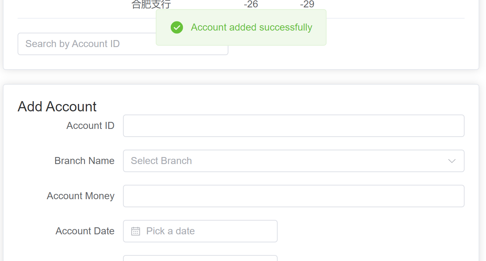

# bank_demo
## 需求分析

### 实体设计

- 银行：<u>支行名字</u>，支行城市，支行资产
- 部门：<u>部门号</u>，部门名称，部门类型，经理员工号
- 员工：<u>员工号</u>，员工姓名，员工电话，开始工作时间，是否银行经理
- 客户：<u>客户身份证号</u>，客户姓名，客户电话，客户住址，联系人姓名，联系人，手机号，联系人邮箱，联系人关系
- 账户：<u>账户号</u>，账户余额，开户日期，最近访问日期
- 储蓄账户：<u>利率</u>
- 支票账户：<u>透支额</u>
- 贷款：<u>贷款号</u>，贷款金额，贷款日期
- 支付：<u>流水号</u>，时间，金额

### 关系设计

|序号|相关实体|联系|联系属性|外码|主码|
|---------|------------|----------|------|----------|------|
|1|支行和账户|一对多||支行号|账户号|
|2|支行和贷款|一对多||支行号|贷款号
|3|贷款和支付|一对多||贷款号|流水号|
|4|支行和部门|一对多||支行号|部门号|
|5|部门和员工|一对多|开始工作时间|部门号|员工号|
|6|员工和客户|多对多||员工号，客户号|共同主码|
|7|账户和客户|多对多|最近访问时间|账户号，客户号|共同主码|
|8|贷款和用户|多对多||贷款号，客户号|共同主码|
|9|账户和储蓄账户|继承||||
|10|账户和支票账户|继承||||


## 总体设计

### 系统模块结构

采用 B/S 架构实现数据库系统，前端采用 Vue 框架，前端 ui 采用 vue3 中的 element-plus 插件实现。后端采用 Django的 Rest Framework 框架，数据库平台使用 Mysql。

### 系统工作流程

#### 主界面


#### 提示信息


#### 业务功能


其他实体类似。

### 数据库设计

#### E/R图

<div align="center">

</div>

### 模式分解

数据模式的关系中每一分量不可再分，满足1NF。每一个非主属性完全函数依赖于码，满足2NF。每一个非主属性不传递依赖于码，满足3NF的要求。综上，该数据库模式满足3NF的设计要求。

### 存储过程、触发器、函数等设计思路

- 存储过程：各实体的增删查改等
- 触发器：存取款的时候更新账户所属银行的总资产
- 事务：账户之间的转账

## 代码讲解

### 仓库地址

> https://github.com/KI-116/bank_demo.git

### 后端实现

#### 后端目录

```
D:.
│  db.sqlite3
│  manage.py
│  __init__.py
│
├─bank
│  │  admin.py
│  │  apps.py
│  │  models.py-----------------------------实体
│  │  serializers.py------------------------事务
│  │  tests.py------------------------------测试
│  │  urls.py-------------------------------app路由
│  │  views.py------------------------------视图
│  │  __init__.py
│  │
│  ├─migrations
│  │  │  0001_initial.py
│  │  │  __init__.py
│  │  │
│  │  └─__pycache__
│  │          0001_initial.cpython-39.pyc
│  │          __init__.cpython-39.pyc
│  │
│  └─__pycache__
│          admin.cpython-39.pyc
│          apps.cpython-39.pyc
│          models.cpython-39.pyc
│          serializers.cpython-39.pyc
│          urls.cpython-39.pyc
│          views.cpython-39.pyc
│          __init__.cpython-39.pyc
│
└─bank_project
    │  asgi.py
    │  settings.py--------------------------配置
    │  urls.py------------------------------总路由
    │  wsgi.py
    │  __init__.py
    │
    └─__pycache__
            settings.cpython-39.pyc
            urls.cpython-39.pyc
            wsgi.cpython-39.pyc
            __init__.cpython-39.pyc
```

#### models.py
在该文件定义了模型,如account模型，其继承自django.db.models.Model，主键为`account_id`，`BranchName`为外键，引用`Branch`的`name`域。

``` python
//backend\models.py

from django.db import models

class Account(models.Model):
    account_id = models.CharField(max_length=30, primary_key=True)
    BranchName = models.ForeignKey(Branch, on_delete=models.RESTRICT)
    account_money = models.DecimalField(max_digits=15, decimal_places=2)
    account_date = models.DateField()
    account_active_date = models.DateField()
    is_cheque = models.BooleanField()
    overdraft = models.DecimalField(max_digits=15, decimal_places=2, null=True, blank=True)
    rate = models.FloatField()
```
#### serializers.py

该文件定义了每个模型的`serializer`，还可以定义模型的合法性检查。

继承自`rest_framework.serialezers.ModelSerializer`,在子类Meta中指明是哪一模型的序列化器，并序列化所有域。

如account的序列化器：

``` python
//backend\serializers.py
class AccountSerializer(serializers.ModelSerializer):
    class Meta:
        model = Account
        fields = '__all__'
```

#### views.py

该文件具体定义了每一个接口，以及接口的功能。

每个模型都建立了ViewSet，默认提供增、删、查、改功能。

#### 路由

``` python 
//backend\urls.py
router = DefaultRouter()
router.register(r'branches', BranchViewSet)
router.register(r'accounts', AccountViewSet)
router.register(r'customers', CustomerViewSet)
...
urlpatterns = [
    path('', include(router.urls)),
    path('customers/<str:customer_id>/', CustomerDetail.as_view(), name='customer-detail'),
    path('accounts/<str:account_id>/', AccountDetail.as_view(), name='account-detail'),
    ...
]

```

如：

`http://localhost:8000/api/accounts/`获取账户列表

`http://localhost:8000/api/accounts/<str:account_id>/`获取查询id的账号

### 前端实现

#### 菜单栏

```javascript
//frontend\Aside.vue
export default {
    setup() {
      const route = useRoute();
  
      const routers = reactive(
      {
        path: 'banksystem',
        meta: { title: 'BankSystem', icon: 'banksystem' },
        children: [
          {
            path: 'overview',
            meta: { title: 'Overview', icon: 'overview' },
          },
          {
            path: 'manual',
            meta: { title: 'Manual', icon: 'manual' },
          }
        ]
      },
      {
        path: 'accounts',
        meta: { title: 'Accounts', icon: 'accounts' },
        component: () => import("@/views/Account.vue")
      },
    ...
      )
    }
}
```

#### 路由
```javascript
//frontend\router.js
import Branch from "@/views/Branch.vue";
...
const routes = [
    {
        path: '/branches',
        name: 'Branches',
        component: Branch
    },
    ...
]
export { routes };
```
#### 数据显示

点击菜单栏中的选项会进入新的页面。
以branch页面为例：
##### 信息表格
``` vue
    <el-card>
      <div slot="header" class="clearfix">
        <span>Branch Management</span>
      </div>
      <el-table :data="branches" style="width: 100%">
        <el-table-column prop="BranchName" label="Branch Name" width="150"></el-table-column>
        <el-table-column prop="City" label="City"></el-table-column>
        <el-table-column prop="assets" label="Assets"></el-table-column>
        <el-table-column label="Actions" width="180">
          <template slot-scope="scope">
            <el-button size="mini" @click="openDialog('edit', scope.row)">Edit</el-button>
            <el-button size="mini" type="danger" @click="deleteBranch(scope.row.BranchName)">Delete</el-button>
          </template>
        </el-table-column>
      </el-table>
    </el-card>
```
##### 输入框

``` vue
    <el-card style="margin-top: 20px;">
      <div slot="header">
        Add Branch
      </div>
    <el-form :model="formData" label-width="100px">
      <el-form-item label="Branch Name" prop="BranchName">
        <el-input v-model="formData.BranchName"></el-input>
      </el-form-item>
      <el-form-item label="City" prop="City">
        <el-input v-model="formData.City"></el-input>
      </el-form-item>
      <el-form-item label="Assets" prop="assets">
        <el-input v-model="formData.assets" type="number"></el-input>
      </el-form-item>
      <el-form-item>
        <!-- 提交按钮 -->
        <el-button type="primary" @click="addBranch">Add Branch</el-button>
      </el-form-item>
    </el-form>
  </el-card>
```

#### 前后端交互

使用 axios 实现前端和后端之间的跨域访问。
``` javascript
import axios from 'axios';

export default {
  data() {
    return {
      branches: [],
      formData: {
        BranchName: '',
        City: '',
        assets: ''
      }
    };
  },
  methods: {
    fetchBranches() {
      axios.get('http://localhost:8000/api/branches/')
        .then(response => {
          this.branches = response.data;
        })
        .catch(error => {
          console.error('Error fetching branches:', error);
        });
    },
    ...
  }
```

## 实验与测试

### 依赖

#### 前端

使用`npm install`命令即可。

#### 后端

已生成requirements.txt。

```
asgiref==3.8.1
automium==0.2.6
automium-web==0.1.1
bank==0.0.1
blinker==1.8.2
click==8.1.7
colorama==0.4.6
Django==4.2.13
django-cors-headers==4.3.1
djangorestframework==3.15.1
Flask==3.0.3
importlib_metadata==7.1.0
itsdangerous==2.2.0
Jinja2==3.1.4
legacy==0.1.7
MarkupSafe==2.1.5
mysqlclient==2.2.4
sqlparse==0.5.0
typing_extensions==4.12.2
tzdata==2024.1
views==0.3
Werkzeug==3.0.3
zipp==3.19.2
```

### 部署

对后端：
``` shell
(venv) PS D:\24SP\DB\bank_demo\django> cd bank_project           
(venv) PS D:\24SP\DB\bank_demo\django\bank_project> python manage.py runserver
Watching for file changes with StatReloader
Performing system checks...

System check identified no issues (0 silenced).
June 20, 2024 - 19:42:53
Django version 4.2.13, using settings 'bank_project.settings'
Starting development server at http://127.0.0.1:8000/
Quit the server with CTRL-BREAK.

```

对前端：
``` shell
D:\24SP\DB\frontend>npm run dev
> frontend@0.0.0 dev
> vite


  VITE v4.3.9  ready in 8067 ms

  ➜  Local:   http://localhost:8080/
  ➜  Network: use --host to expose
  ➜  press h to show help
```

#### 实验结果

- 增

- 删


- 存款


- 触发器

- 转账事务


- 后台信息

